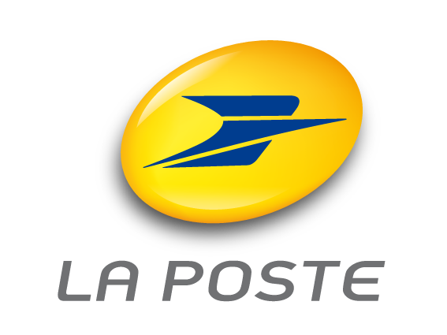
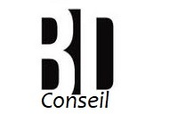
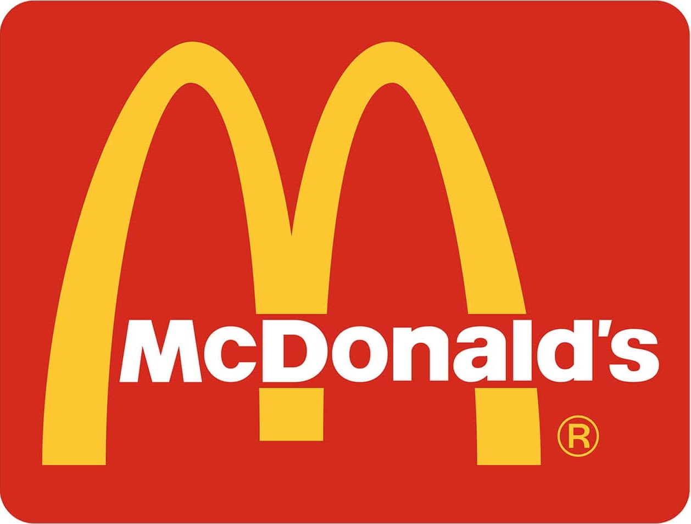
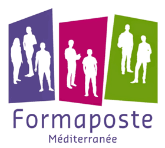
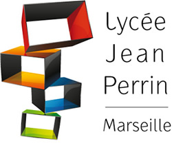
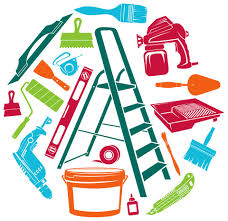

<head>
    <title>CV de Bruno Deseure</title>
    <meta charset="utf-8">
    <meta name="viewport"
          content="width=device-width, initial-scale=1, user-scalable=no">
    <link rel="stylesheet" href="cv-bruno.css">
</head>
<body>
    <header>
        <h1>CV de Bruno Deseure</h1>
    </header>
    
    <section>
        

            
        

        

            <h2>Présentation</h2>
            
Fort de 20 ans d'expérience en entreprise, j'ai développé une grrande rigueur et un sens aigu des responsabilités.
			D’un naturel curieux, rigoureux et méthodique, mon parcours m'a permis d'acquerir une solide capacité d'adaptation et
			une vigilance constante en matière de sécurité et de respect des process.
			Titulaire d'un baccalauréat tecchnique, je suis aujourdh'ui déterminé à mettre ma réactivité et mon esprit d'équipe 
			au profit d'un environnement industriel exigeant.
			

            <a href="cvbrunoorano.pdf" target="_blank" download>Télécharger mon CV</a>
        

        

            <h2>Informations de contact</h2>
            

                
Nom : 

                
Deseure Bruno

            

            

                
Adresse : 

                
11 rue Maréchal Foch - 11130 Sigean

            

            

                
Téléphone :

                
06 50 05 92 24

            

            

                
Mail : 

                
<a href="mailto:brunodu1301106@yahoo.fr">brunodu1301106@yahoo.fr</a>

            

            

                
Permis :

                
B, A1 et A2

            

            

            	
Réseau sociaux :

            	

            		<ul><li></li>
                        <li></li>
                        <li></li>
                   </ul>
                

            

        

    </section>
    
    <section>
        <h2>Expériences professionnelles</h2>
        

            

                
            

            

                <h3>Agent distribution</h3>
                <h4>La Poste</h4>
                <h4>Juin 2008 - Aujourd'hui</h4>
            

            

                
Agent distributeur de plis et colis, réalisation de nouveau services tels que vsmp, installation tnt etc.., vente et apport afin de satisfaire les attentes des clients.

            

        

        

            

                
            

            

                <h3>Conseiller en publicité et marketing</h3>
                <h4>Entrepreneur</h4>
                <h4>Mai 2007 - Mars 2008</h4>
            

            

                
Démarchage de marque, afin de les implanter dans le commerce local et de proximité. Réalisation d’animation commerciale, de visuel publicitaire.

            

        

        

            

                
            

            

                <h3>Agent de sécurité</h3>
                <h4>PACA protection</h4>
                <h4>février 2006 - mai 2007</h4>
            

            

                
Développement du métier de la sécurité, conseil sur renforcement vidéo surveillance. Gestion occasionnelle d’équipe.

            

        

        

            

                
            

            

                <h3>Agent polyvalent</h3>
                <h4>Mc Donald</h4>
                <h4>février 2004 - février 2006</h4>
            

            

                
Equipier polyvalent, travaillant en Front office et Back office.

            

        

    </section>
    
    <section>
        <h2>Formation</h2>
        

            

                
            

            

                <h3>formaposte méditerranée</h3>
                <h4>Décembre 2007 -  Juin 2008</h4>
            

            

                
Certificat d'Aptitude Professionnelle Tri Acheminement Distribution : Acquisition des bases des métiers de l’acheminement et de la distribution d’objet ou plis. 
				

            

        

        

            

                
            

            

                <h3>Lycée Jean perrin</h3>
                <h4>2004</h4>
            

            

                
Baccalauréat  science technique de l’ingénieur option production Spécialité dessin industriel, programmation machine outil et conception 3D.
				

            

        

        
    </section>
    
    <section>
        <h2>Compétences</h2>
        <h3 class="h3gauche">Professionnelles</h3>
        

            
HTML / CSS via <em><a href="https://openclassrooms.com/fr/courses/1603881-apprenez-a-creer-votre-site-web-avec-html5-et-css3">Open class room</a></em>

            

        

        

            
JavaScript via <em><a href="https://edabit.com/user/CQXHmoPMMbXCGfnfa" title="mon profil">edabit</a></em> et <em><a href="https://www.hackerrank.com/brunodu1301106?hr_r=1" title="mon profil">hackerrank</a></em>

            

        

        

            
Office

            

        

        

            
Windows/Mac

            

        

        <h3 class="h3gauche">Personnelles</h3>
        

            
Créativité

            
95%

            

        

        

            
Adaptation

            
85%

            

        

        

            
Sérieux

            
90%

            

        

        

            
Pédagogie

            
85%

            

        

    </section>
    
    <section>
        <h2>Centres d'intérêt</h2>
        <figure class="interet">
            
            <figcaption>bricolage</figcaption>
        </figure>
        <figure class="interet">
            
            <figcaption>Cuisine</figcaption>
        </figure>
        <figure class="interet">
            
            <figcaption>Jeux vidéos</figcaption>
        </figure>
        <figure class="interet">
            
            <figcaption>voyage</figcaption>
        </figure>
    </section>
    
    <footer>
        
<a href="https://deseurebruno.github.io/Bruno-Deseure">©Bruno deseure</a> 2026

           </footer>
</body>

